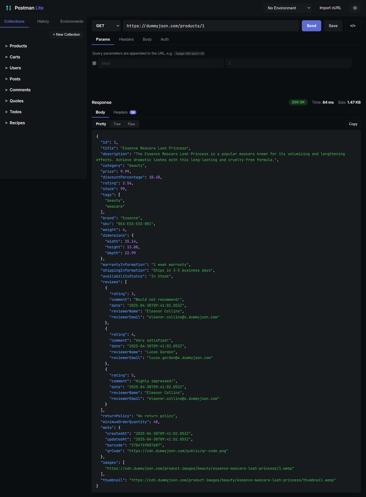

# ⚡ Postman Lite — API Testing Platform

A lightweight, browser-based API testing platform built for developers who want to test APIs quickly without installing heavy tools. Think Postman, minus the bloat.

**Live demo:** _<!-- TODO: paste Render URL here after deploy, e.g. https://postman-lite.onrender.com -->_

## Project Overview

Developers frequently need to test APIs during development, but existing tools are feature-heavy and can overwhelm beginners. Postman Lite runs entirely in the browser (served by a small Express server) and covers the everyday workflow: build a request, send it, read the response, save it for later.

The Express backend doubles as an **HTTP proxy**, which is the key architectural decision: browsers block cross-origin requests (CORS), so the frontend sends the request definition to `POST /api/proxy`, and the server performs the real HTTP call using Node's core `http`/`https` modules. This also enables non-standard methods like the new HTTP `QUERY` method, which `fetch()` in browsers rejects.

Per hackathon rules, **no database is used** — collections, environments, and history persist in the browser's `localStorage`.

## Features

### Core
- **Request builder** — GET, POST, PUT, PATCH, DELETE, and the new **QUERY** method
- **Query parameters** — dynamic key/value rows with enable/disable toggles
- **Header management** — any custom headers (`Content-Type`, `Authorization`, …)
- **Request body** — JSON (with live validation + beautify), raw text, form-data, x-www-form-urlencoded
- **Authentication** — No Auth, Bearer Token, Basic Auth, API Key (header or query)
- **Response viewer** — status code, response time, response size, headers table, and auto-formatted JSON with syntax highlighting
- **Collections** — organize saved requests into named folders (rename/delete supported)
- **Environment variables** — define `BASE_URL`, `TOKEN`, etc. and use them anywhere as `{{BASE_URL}}/api/users`

### Bonus / creative
- **Request history** — every sent request is auto-logged, grouped by day, restorable in one click
- **Code snippet generator** — export the current request as cURL, JavaScript `fetch`, or axios
- **cURL import** — paste any cURL command (e.g. from browser DevTools "Copy as cURL") and it fills the builder
- **JSON tree view** — collapsible tree for exploring large responses
- **Dark/light theme** — persisted across sessions
- **Draft auto-save** — the in-progress request survives page refreshes
- **Keyboard shortcut** — `Ctrl+Enter` (or `Cmd+Enter`) sends the request
- **Responsive layout** — the sidebar collapses into a hamburger drawer on tablet/mobile widths

## Installation

Requirements: Node.js 18+

```bash
# 1. Install dependencies (just Express)
npm install

# 2. Start the server
npm start

# 3. Open the app
# http://localhost:5000
```

For development with auto-restart on file changes:

```bash
npm run dev
```

## Folder Structure

```
postman-lite/
├── package.json
├── src/                          # Backend (Node + Express)
│   ├── server.js                 # Bootstrap: static hosting + mount routes
│   ├── config.js                 # Port, timeouts, size caps
│   ├── routes/
│   │   ├── proxy.routes.js       # POST /api/proxy
│   │   └── echo.routes.js        # /api/echo — reflects any method (incl. QUERY)
│   ├── controllers/
│   │   └── proxy.controller.js   # Validate payload + shape the HTTP response
│   ├── services/
│   │   └── http-proxy.service.js # Performs the real CORS-bypassing HTTP call
│   └── utils/
│       ├── validation.js         # Input checks + header hygiene
│       ├── response-decoder.js   # Buffering, gzip/br decode, 10 MB cap
│       └── network-errors.js     # Friendly error text + timing
└── public/                       # Frontend (vanilla JS, no build step)
    ├── index.html                # Single-page layout: sidebar, builder, response
    ├── css/
    │   └── styles.css            # Theming via CSS variables (dark/light)
    └── js/
        ├── app.js                # Entry point — wires all modules together
        ├── core/
        │   ├── utils.js          # Shared helpers (dom, toast, formatting)
        │   └── storage.js        # localStorage persistence layer (no DB!)
        ├── components/
        │   └── kv-editor.js      # Reusable key/value row editor component
        └── features/
            ├── request.js        # Request state, env substitution, auth, send
            ├── response.js       # Response rendering (pretty / tree / raw)
            ├── collections.js    # Saved request collections (CRUD + tree UI)
            ├── environments.js   # Environment variables + {{VAR}} substitution
            ├── history.js        # Auto-logged request history
            ├── snippets.js       # cURL / fetch / axios snippet generator
            ├── sample-collections.js # first-visit DummyJSON example collections
            └── curl-parser.js    # cURL command → request state parser
```

## Technologies Used

| Layer      | Technology                                   |
|------------|----------------------------------------------|
| Frontend   | Vanilla JavaScript (ES modules), HTML5, CSS3 |
| Backend    | Node.js + Express                            |
| HTTP layer | Node core `http` / `https` modules           |
| Storage    | Browser `localStorage` (no database)         |

No frontend frameworks, no build step, one npm dependency (Express).

## Application Workflow

1. **Build** — pick a method, type a URL (optionally with `{{variables}}`), add params/headers/body/auth in the tabs.
2. **Send** — the frontend resolves environment variables, assembles the final request, and POSTs it to `/api/proxy`.
3. **Proxy** — the server validates the input, performs the real HTTP call (any method, any host), measures the round-trip time, decompresses gzip/deflate/brotli, and caps responses at 10 MB.
4. **View** — the response renders with a status pill, timing, size, headers, and formatted body (Pretty / Tree / Raw).
5. **Save & reuse** — save the request into a collection, or restore any past request from History. Everything persists in `localStorage`.

```
Browser (builder UI)                Express server                 Target API
        │  POST /api/proxy                │                             │
        │  {url, method, headers, body}   │                             │
        │ ───────────────────────────────►│  real HTTP request          │
        │                                 │ ───────────────────────────►│
        │                                 │◄─────────────────────────── │
        │◄─────────────────────────────── │  response                   │
        │  {status, headers, body,        │                             │
        │   timeMs, sizeBytes}            │                             │
```

## Screenshots

### Request builder & formatted response



<!-- Add more as you capture them (drop the files in docs/screenshots/ and uncomment):
### Creating a resource (POST)


### Collections & environment variables


### JSON tree view

-->

## Design Decisions

- **Proxy over direct fetch** — avoids CORS entirely and unlocks the `QUERY` method, which browser `fetch()` refuses to send.
- **`localStorage` behind one module** (`storage.js`) — the rest of the code never touches storage directly, so swapping the persistence layer later means changing one file.
- **Reusable `KvEditor` component** — params, headers, form fields, and environment variables all share one implementation with a "ghost row" pattern (start typing in the empty last row and a new one appears).
- **Unknown `{{variables}}` are left as-is** rather than replaced with empty strings, so typos are visible in the sent request instead of failing silently.

## Quick Test

After starting the server, try:

- `GET https://jsonplaceholder.typicode.com/users?_limit=3` — JSON formatting, params
- `POST https://jsonplaceholder.typicode.com/posts` with a JSON body — request bodies
- Create an environment with `BASE_URL=https://jsonplaceholder.typicode.com`, then request `{{BASE_URL}}/todos/1` — variables

### Testing the QUERY method

`QUERY` is a new (2024 draft) HTTP method that public APIs don't implement yet, so
sending it to them returns `404 Cannot QUERY …` / `405` — which itself proves the app
*sent* a real QUERY request (a browser's `fetch()` can't, and cross-origin CORS blocks it).

To see a full **200** round-trip, send QUERY to this app's own built-in echo endpoint,
which reflects any method back:

```
method: QUERY   URL: <this site>/api/echo     → 200  { "method": "QUERY", ... }
```

Locally that's `http://localhost:5000/api/echo`; on the deployed site it's
`https://<your-app>.onrender.com/api/echo`. The proxy sends the method through Node's
core `http.request`, so `QUERY` flows through exactly like `GET` or `POST`.
